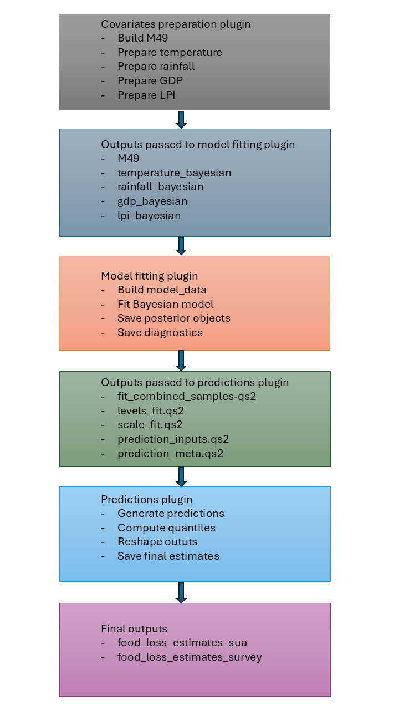
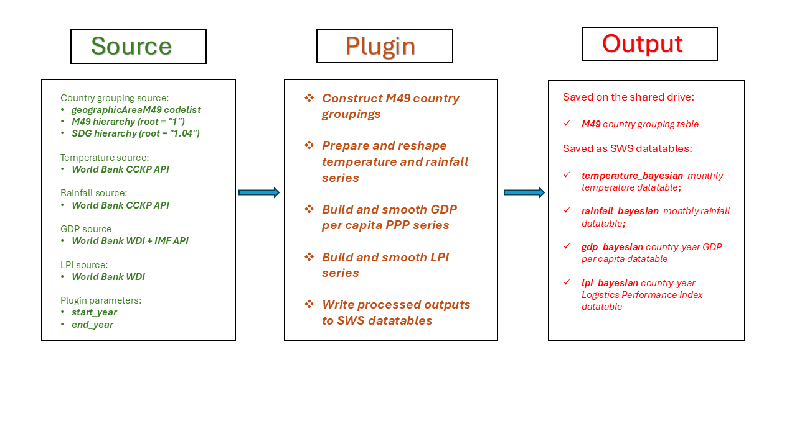
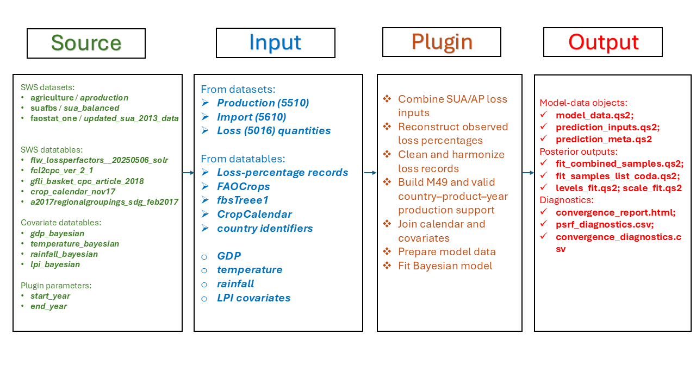
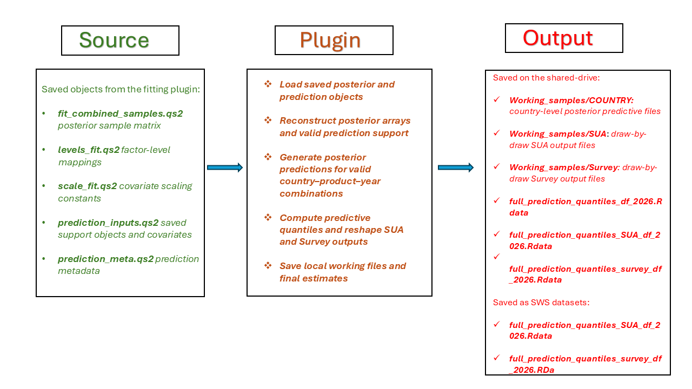

# Introduction

This document describes the current implementation of the Bayesian food loss estimation workflow developed in R for use within the FAO Statistical Working System (SWS). The workflow has been designed to support the preparation, estimation, prediction, and saving of Bayesian food loss estimates in a modular way, so that the different stages of the process can be run, checked, and updated separately.

The overall objective of the workflow is to generate model-based food loss estimates by combining observed loss data with a set of external covariates and hierarchical grouping structures. In practical terms, the process brings together information on countries, products, production support, harvest timing, climate conditions, GDP per capita, and logistics performance, and uses these inputs to fit a Bayesian hierarchical model capable of producing posterior predictive estimates for valid country-product-year combinations.

The implementation is currently organized into three main R plugins:

1. **Covariates preparation plugin**
2. **Model fitting plugin**
3. **Predictions plugin**

These three plugins form a connected pipeline. The first plugin prepares the country grouping framework and the main external covariates required by the model, and stores them in intermediate SWS datatables. The second plugin reads these prepared inputs, constructs the modelling dataset, fits the Bayesian hierarchical model, and saves the posterior outputs together with the auxiliary objects needed for prediction. The third plugin uses the saved posterior samples and prediction inputs to generate posterior predictive distributions, summarize them into quantiles, reshape the outputs into the required SWS structure, and save the final estimates to the target datasets.

A central feature of this implementation is its reliance on a hierarchical country and product structure. Countries are organized using a custom grouping system derived from both M49 and SDG hierarchies, while products are linked to food groups, CPC items, and country-product interaction levels. This structure allows the model to borrow strength across related countries, subregions, and food groups, which is especially important in a context where observed loss data are sparse, unevenly distributed, or missing for many combinations of country, year, and product.

Another key aspect of the workflow is the explicit preparation and smoothing of covariates before model fitting. Rather than relying directly on raw downloaded series, the implementation preprocesses temperature, rainfall, GDP per capita, and Logistics Performance Index data into forms that are consistent with the modelling support and the prediction stage. This improves reproducibility, keeps the estimation step more controlled, and makes it easier to trace how each covariate enters the model.

The workflow is also designed with operational use in mind. Intermediate objects are saved between stages, and the ordered category definitions used when variables are converted to factors in R are preserved for consistency between fitting and prediction. In this workflow, this includes variables such as country, region, food group, product, stage, method, source, and interaction identifiers. Preserving these factor levels is essential because they determine the numeric indexing used by the Bayesian model and must remain unchanged when posterior predictions are generated. This makes the implementation more robust for repeated runs, testing, and future modifications, while also helping control memory usage and computational load.

This workflow is designed to support reproducible execution by saving intermediate objects between stages, preserving the factor-level structure used during fitting, and storing the scaling constants and prediction-support objects required by downstream steps. Reproducibility is further supported by the use of renv.lock to maintain a controlled package environment.

This document provides technical documentation of the current implementation as reflected in the existing R code. Its purpose is to describe what has been implemented, how the three plugins are connected, what data structures and intermediate outputs are created, and how the final estimates are produced and written back into SWS. 

In the following sections, the workflow is described step by step, beginning with the preparation of covariates, then the construction and fitting of the Bayesian model, and finally the generation and saving of posterior predictions.

# General workflow

The Bayesian food loss estimation workflow is organized as a sequential pipeline composed of three main R plugins. Each plugin performs a distinct part of the process, but the three stages are tightly connected through shared intermediate outputs, common grouping structures, and saved model objects.

The first stage is focused on covariates preparation and is implemented through the SWS plugin <strong>bayesian_food_loss_covariates</strong>. Its role is to construct the main support objects and external covariates required by the modelling workflow. In particular, it builds the country grouping table used throughout the project, prepares the modelling country list, retrieves and reshapes weather covariates, prepares GDP and Logistics Performance Index data, and saves the processed outputs into dedicated SWS datatables. These intermediate outputs are designed to be reused by later stages rather than recomputed every time the model is fit.

The second stage is focused on model fitting and is carried out by the SWS plugin <strong>bayesian_food_loss</strong>. This plugin loads the prepared covariates together with the main model inputs, reconstructs the grouping structure used by the model, and builds the final model training dataset. At this stage, the observed food loss data are joined with product information, production support, harvest calendar information, climate covariates, GDP, and LPI. The plugin then performs several preprocessing steps, including filtering, imputation, aggregation of repeated series, treatment of duplicated or low-variance observations, and factor construction for the hierarchical model. Once the training dataset is ready, the plugin fits the Bayesian hierarchical model in NIMBLE and saves the posterior samples and auxiliary objects needed for prediction.

The third stage concerns posterior prediction and output generation and is carried out by the SWS plugin <strong>bayesian_food_loss_pred</strong>. This final stage loads the posterior draws from the fitted model together with the saved prediction inputs and metadata. Using these objects, it reconstructs the necessary coefficient arrays, generates posterior predictions for valid country-product-year combinations, and computes predictive quantiles. The plugin then reshapes the resulting outputs into the structure required by the target SWS datasets and saves the final food loss estimates separately for the SUA and Survey outputs.

A central characteristic of the workflow is that it is modular but not independent across stages. The outputs of the first plugin are directly consumed by the second, and the outputs of the second are essential inputs for the third. For this reason, consistency of country codes, factor levels, year ranges, and support restrictions is critical across the entire pipeline. In particular, the workflow preserves common structures such as the `M49` grouping table, the valid production support combinations, the factor level mappings used in the fitted model, and the scaling constants applied to continuous covariates.

Another important feature of the workflow is that predictions are not generated for every theoretical combination of country, product, and year. Instead, the workflow explicitly restricts modelling and prediction support to valid combinations derived from production data. This ensures that the final outputs remain aligned with the relevant production structure and avoids generating estimates for combinations that fall outside the intended modelling support.

The workflow is also designed to separate preparation, estimation, and output generation as much as possible from a computational point of view. Intermediate objects are saved between steps, large posterior outputs are stored in compressed form, and prediction outputs are generated and saved in chunks in order to control memory usage. This makes the overall implementation more robust, easier to test, and more practical to run within the SWS environment.

<!-- ## Schematic overview of the Bayesian food loss workflow -->

The figure below provides a schematic overview of the full Bayesian food loss workflow and shows how the three plugins are connected through intermediate objects and final outputs.
{#fig:general_workflow width="100%"}
In summary, the workflow can be read as a three-step process: first prepare the modelling covariates and country structure, then fit the Bayesian model on the processed training data, and finally use the posterior results to generate and save food loss predictions. The following sections describe each of these three plugins in detail.

# Covariates preparation

The covariates preparation stage is carried out by the SWS plugin <strong>bayesian_food_loss_covariates</strong>. Its role is to prepare the main support objects and external covariates required by the Bayesian food loss workflow before model fitting. In practical terms, this stage constructs the country grouping structure used throughout the pipeline, defines the modelling year range, prepares climate and macroeconomic covariates, and stores the processed outputs in SWS datatables so that they can be reused by downstream plugins.

A key objective of this stage is to separate raw data retrieval from model estimation. Rather than downloading and processing all external inputs inside the fitting stage, the workflow prepares them in advance and saves them in a standardized form. This makes the later stages more reproducible, reduces repeated computation, and helps ensure that model fitting and prediction use a consistent set of covariates and support definitions.

## Purpose

The main purpose of this stage is to create a coherent and reusable covariate layer for the Bayesian model. More specifically, the plugin:

- constructs the country grouping table used by the workflow;
- defines the modelling year range based on plugin parameters;
- downloads and reshapes monthly temperature and rainfall data;
- prepares PPP (Purchasing Power Parity) GDP per capita data by combining World Bank and IMF sources;
- prepares Logistics Performance Index data from the World Bank;
- smooths selected macroeconomic covariates where required; and
- writes the final processed outputs into dedicated SWS datatables.

These outputs are later read by the model fitting plugin and are also indirectly used during the prediction stage.

## Parameters

The plugin uses two computation parameters to define the modelling year range:

- `start_year`, with default value `1991`;
- `end_year`, with default value `2024`.

These parameters are used to build the vector `years_out`, which determines the years for which the plugin prepares the covariates and related support objects.

In the current implementation, the covariates preparation plugin is tied to the source coverage and source-specific retrieval logic used in the code. In particular, some inputs are obtained through hard-coded external endpoints or versioned source files, so extending the workflow to years beyond the currently covered period may require updating the download logic, endpoint references, or source files used by the plugin. This is especially relevant for climate inputs, where the current code is explicitly configured to use the historical monthly series up to 2024, and for source series such as LPI, whose observed coverage is more limited than the full modelling year range. For example, the LPI source series used through the World Bank indicator `LP.LPI.OVRL.XQ` is currently available only through 2022. As a result, for later model years the workflow relies on the plugin’s smoothing procedure rather than on newly observed LPI values.

## Country grouping table

The first major task performed by the plugin is the construction of the country grouping table, referred to in the code as `M49`. This table is a central object in the workflow because it defines the country-level grouping structure used in the subsequent modelling stages.

The table is derived from the `geographicAreaM49` codelist in the `lossWaste` domain and from two tree structures:

- the M49 hierarchy rooted at `"1"`;
- the SDG hierarchy rooted at `"1.04"`.

Starting from these structures, the plugin identifies the set of country codes that are valid leaves in both hierarchies and then derives, for each country, its corresponding SDG region and M49-based higher-level grouping.

A central feature of this construction is the creation of two custom hierarchical aggregation levels:

- `sdg_subregion_l1`
- `sdg_subregion_l2`

These two levels are hybrid groupings derived from both the SDG and M49 hierarchies and are designed specifically for the Bayesian modelling framework.

At level 1, countries are grouped into broad modelling regions such as Asia, Europe, Northern Africa and Western Asia, Sub-Saharan Africa, Latin America and the Caribbean, Northern America, and Oceania excluding Australia and New Zealand.

At level 2, countries are assigned to a more detailed regional subdivision. Depending on the level 1 group, this second level is derived from M49 subregions or, where needed during the construction logic, from intermediate regional structure. For example, Asian countries are split into subregions such as Southern Asia or Eastern Asia, and European countries into Northern, Southern, Eastern, or Western Europe. At the same time, Australia and New Zealand are joined with Northern America, since it is believed they have some similarities in their agroeconomic structures, and Northern Africa is merged with Western Asia, reflecting similarity in climate and terrain. 

After the grouping structure is constructed, ISO3 codes are attached to countries using the `countrycode` package, with manual handling for selected special cases. Countries not retained in the intended modelling structure are removed.

The final `M49` table therefore provides, for each country, the country code, country name, SDG region, level 1 grouping, level 2 grouping, ISO3 code, and the aliases and numeric identifiers later used by the model, such as `region_l1`, `region_l2`, `l1_num`, `l2_num`, and `m49_numeric`.

## Raw covariate output directory

The plugin creates a directory under the shared path to store raw or wide-format extracts of the downloaded covariates. This directory is used for traceability and inspection purposes and contains Excel versions of the climate, GDP, and LPI inputs before or alongside their transformation into final long-format SWS datatables.

## Weather covariates

### Temperature

Temperature data are downloaded from the World Bank Climate Knowledge Portal API using the CRU TS 4.09 historical monthly time series. The response is returned in JSON format and contains country-level monthly values indexed by year and month.

The plugin parses the JSON response, extracts the temperature component, and reshapes the data in two stages. First, it builds a wide table with one row per country and one column per month. This wide version is saved locally as an Excel file for traceability. Second, it converts the same data into long format and separates the combined time identifier into distinct `year` and `month` variables.

The final processed temperature output is written to the SWS datatable `temperature_bayesian`, using the variables:

- `isocode`
- `year`
- `month`
- `temperature_c`

This datatable is later read by the model fitting plugin and used to derive climate covariates aligned to the harvest period defined from the crop calendar.

### Rainfall

Rainfall is prepared in the same way as temperature and is obtained from the same World Bank Climate Knowledge Portal API response. After extracting the precipitation component from the JSON structure, the plugin first builds a wide country-by-month table, saves it locally as an Excel file, and then reshapes it into long format with separate year and month columns.

The final rainfall output is written to the SWS datatable `rainfall_bayesian`, using the variables:

- `isocode`
- `year`
- `month`
- `rainfall_mm`

Together, the temperature and rainfall datatables provide the climate covariates later matched to harvest timing in the model fitting stage.

## GDP per capita covariate

GDP per capita PPP is prepared by combining two external sources:

- World Bank WDI data, using indicator `NY.GDP.PCAP.PP.CD`;
- IMF DataMapper data, using indicator `PPPPC`.

The plugin first retrieves the World Bank series for all available countries and years and saves a wide-format extract locally. It then retrieves the IMF series through the IMF API and also stores a wide-format extract. Both sources are transformed into long format and restricted to the modelling countries and years.

The two sources are then merged into a single table. World Bank values are used as the preferred source, while IMF values are used only when the World Bank value is missing. The plugin keeps track of the data source used for each country-year combination.

An additional manual imputation is implemented for South Sudan, where pre-observation values are blended with Sudan values up to the first available South Sudan GDP observation.

The resulting GDP series is then smoothed separately by country using a Generalized Additive Model on the log scale:

$$log(GDPpercapita) \sim Normal(\alpha_0 + f(year), \sigma^2_{GDP})$$

where $f(year)$ is a smooth function of time. A log transformation on the left-hand side of the equation is used so that the distribution of the model residuals is closer to the assumed Normal distribution and so that the model cannot predict negative GDp per capita values. This model is implemented in the `mgcv` package in `R`, with a cubic spline basis assumed for $f(year)$. For each country, the number of knots for $f(year)$ is specified as the number of years for which GDP per capita estimates are available, divided by four and rounded up.

The smoothed series is stored in the variable `sm_GDP_percap`, while the unsmoothed combined series is kept as `GDP_percap`. Remaining missing smoothed values are imputed using the mean within `region_l2` and year.

The final GDP output is written to the SWS datatable `gdp_bayesian`, using the variables:

- `isocode`
- `year`
- `gdp_sm`
- `gdp_percap`

## Logistics Performance Index covariate

The Logistics Performance Index covariate is prepared from the World Bank WDI indicator `LP.LPI.OVRL.XQ`. The plugin downloads the raw series for all available countries and years, saves a wide-format extract locally, and then reshapes the data into long format.

After excluding aggregate regions, the plugin joins the LPI observations to the full country-year grid and the smoothed GDP covariate, and then fits a generalized additive model with `mgcv::bam`. The model represents LPI as the sum of a smooth effect of standardized year (`s(year_sc, k = 7)`), a smooth effect of standardized smoothed GDP per capita (`s(sm_GDP_percap_sc)`), a country random intercept (`s(iso3, bs = "re")`), and a country-specific random slope on year (`s(iso3, bs = "re", by = year_sc)`). The smooth term are represented using thin-plate spline basis functions with second-order smoothing penalties. For the year effect, the model uses 7 knots, corresponding to one knot for each year in which observed LPI data are available, while for the smooth effect of smoothed GDP per capita it uses the default basis dimension of 10 knots. The fitted model is then used to predict smoothed LPI values for the full grid of modelling countries and years. More in detail, a single smooth regression modelling approach is implemented:

$$
LPI \sim Normal(\beta_0 + f_1 (year) + f_2 (GDPpercapita) + g_1 (country) + g_2(country)\times year, \sigma^2_{LPI})
$$

where $f_1(year)$ and $f_2(GDPpercapita)$ are smooth functions of centered and scaled year and of smooth GDP per capita, and $g_1$ and $g_2$ are country-level random intercepts and slopes of the centered and scaled year. Thus the two smooth functions pool information across countries for which LPI data were available, to allow prediction in countries without LPI, while the random intecepts and slopes allow for a closer fit for interpolation in countries with data for some years.

 The resulting smoothed LPI series is stored in `sm_lpi` in the intermediate object `LPI_full`, while the original observed series is retained in `lpi`. In the final output written to SWS, these are saved as `lpi_sm` and `lpi_raw`, respectively.

The final LPI output is written to the SWS datatable `lpi_bayesian`, using the variables:

- `isocode`
- `year`
- `lpi_sm`
- `lpi_raw`

## Main outputs

At the end of this stage, the plugin produces the main processed covariates objects required by the rest of the workflow. The principal outputs are:

- the `M49` country grouping table;
- the SWS datatable `temperature_bayesian`;
- the SWS datatable `rainfall_bayesian`;
- the SWS datatable `gdp_bayesian`;
- the SWS datatable `lpi_bayesian`.

In addition, the plugin stores raw or wide-format Excel files for inspection and reproducibility purposes.

## Schematic workflow of the covariates preparation plugin

The figure below provides a schematic overview of the covariates preparation plugin. It summarizes the main source inputs, the core processing steps carried out inside the plugin, and the processed outputs produced for downstream use in the Bayesian food loss workflow.

{#fig:covariates-workflow fig-align="center" width="100%"}

As shown in the Figure above, the plugin starts from the country hierarchy and external climate and macroeconomic sources, constructs the `M49` country grouping table, prepares the temperature, rainfall, GDP, and LPI covariates, and then writes the processed outputs for use by the subsequent stages of the workflow.

## Role in the overall workflow

This stage provides the covariates backbone of the Bayesian food loss estimation workflow. The outputs generated here are directly used by the model fitting plugin, which reads the prepared weather, GDP, and LPI datatables and combines them with the harvest calendar, product support, and observed loss data. As a result, the correctness and consistency of this covariates preparation stage are essential for both the fitting and the prediction phases that follow.

# Model fitting

The model fitting stage is carried out by the SWS plugin <strong>bayesian_food_loss</strong>. This stage is responsible for transforming the available food loss observations and the prepared covariates into a coherent training dataset, estimating the Bayesian hierarchical model in NIMBLE, and saving all the posterior outputs and auxiliary objects required by the prediction stage.

In operational terms, this stage sits at the center of the workflow. The previous stage produces the covariates layer and the country grouping structure, while the following stage depends entirely on the saved outputs created here. For this reason, the fitting stage does not simply estimate a model: it also defines the final modelling support, reconstructs the grouping structure used by the hierarchy, aligns all identifiers and factor levels, and preserves the scaling conventions that must later be reused in prediction.

A particularly important feature of this stage is that it combines several different sources of information that were not originally stored in a single unified structure. The observed food loss data, the product reference information, the country groupings, the production support, the harvest calendar, the weather covariates, the GDP covariate, and the LPI covariate all enter the workflow separately. The fitting plugin assembles them into one modelling dataset and then applies a sequence of preprocessing rules intended to reduce duplication, remove invalid support, harmonize labels, and improve the statistical quality of the final estimation input. Here, product reference information refers to the tables that describe and classify products, mainly the mappings between CPC item codes, crop or product names, and food-group groupings used in the model, such as `FAOCrops` and `fbsTree1`.

Even though the outputs of this plugin are saved on the shared drive and not written directly to the final SWS estimate datasets, the user is still required to set `Food loss estimates (SUA level)` as the involved dataset in the plugin configuration.

## Purpose

The purpose of this stage is twofold.

First, it prepares the final training dataset used by the Bayesian food loss model. This includes reconstructing the grouping structure, restricting the support to valid production combinations, attaching the relevant covariates to each observation, and cleaning the observed loss data before estimation.

Second, it estimates the hierarchical Bayesian model and saves the fitted posterior outputs in a form that can be reused directly by the posterior prediction stage.

More specifically, the plugin:

- loads the core model inputs from shared storage;
- reconstructs the `M49` country grouping table and the associated modelling identifiers;
- prepares the production support used to restrict valid country-product-year combinations;
- prepares and imputes the harvest calendar;
- reads the processed GDP, temperature, rainfall, and LPI covariates from SWS datatables;
- constructs the final model training dataset by joining all required components;
- applies duplicate handling, time-series reduction, exclusion rules, factor construction, and outlier treatment;
- defines the hierarchical Bayesian model in NIMBLE;
- runs parallel MCMC estimation; and
- saves the posterior draws and all auxiliary objects needed for prediction.

## Plugin inputs

The plugin uses several categories of inputs.

The first category consists of the core observed loss inputs used to build the training dataset. The model training dataset is assembled inside the plugin by combining SWS-derived observed loss percentages, reconstructed from production, import, and loss quantities, with filtered and harmonized loss-percentage records from `flw_lossperfactors__20250506_solr`.

First, the plugin retrieves the agricultural quantities needed to reconstruct observed SWS loss percentages. In particular, it reads:

- production quantity from the `aproduction` dataset of the `agriculture` domain using element `5510`;
- import quantity from the same source using element `5610`;
- loss quantity using element `5016`, retrieved from both SUA-based and AP-based sources and then combined within the plugin to define the retained observation for each country-product-year combination.

The SUA-side loss quantity is retrieved through `getLossData_SUA()`, which combines:

- `suafbs / sua_balanced` for the new-methodology period;
- `faostat_one / updated_sua_2013_data` for the earlier period.

The AP-side loss quantity is retrieved through `getLossData_AP()`, which reads element `5016` directly from `agriculture / aproduction`.

In both functions, when `protected = TRUE`, the plugin retains only those observations whose flag combination, defined as the pair `(flagObservationStatus, flagMethod)`, is marked as `Protected == TRUE` in `faoswsFlag::flagValidTable`. Thus, in this workflow, “protected” refers to a predefined subset of valid flag combinations used to filter the retained loss observations.

Second, the plugin reads the external loss-factor datatable `flw_lossperfactors__20250506_solr`, which contains loss-percentage records by country, year, product, and supply-chain stage together with source and collection metadata. These observations are filtered, harmonized, deduplicated, and aggregated where needed before being combined with the reconstructed SWS loss observations. Here, harmonization refers mainly to recoding country, product, and supply-chain-stage identifiers into a consistent structure across sources so that the records can be combined and used coherently in the modelling dataset.

Together, these two sources form the core observed loss input from which the final training dataset is built.

Additional supporting inputs used in this part of the workflow include:

- `FAOCrops`, which links CPC item codes to crop descriptions;
- `gfli_basket_cpc_article_2018` (`fbsTree1`), which provides the product-to-food-group mapping used by the model;
- `crop_calendar_nov17` (`CropCalendar`), which provides harvest timing information;
- `a2017regionalgroupings_sdg_feb2017`, which is used to attach country identifiers such as `isocode` and `country` in the preparation of the observed loss inputs.

The second category consists of the covariate datatables prepared by the previous stage and stored in SWS. These include:

- `gdp_bayesian`
- `temperature_bayesian`
- `rainfall_bayesian`
- `lpi_bayesian`

The third category consists of structural support objects recreated inside the plugin, most importantly the country grouping table `M49` and the valid production support derived from the agricultural production dataset.

As in the covariates preparation stage, the plugin defines the modelling year range using the computation parameters `start_year` and `end_year`. If these parameters are not provided, the default range `1991:2024` is used.

In this workflow, country information is used through more than one identifier. The main country key for observed loss data and production support is the M49 code, represented in the plugin mainly through `geographicAreaM49` and `m49_numeric`. At the same time, ISO3 country codes (`isocode` / `iso3`) are used for joining the prepared covariates and for defining some of the model factors. The actual hierarchical country grouping used by the model is provided by the reconstructed `M49` table, in particular through the derived grouping variables `region_l1` and `region_l2`.

## Preparation of structural support objects

Before constructing the training data, the plugin standardizes part of the product classification used by the model. It explicitly reassigns some food groups, such as splitting roots and tubers and oil-bearing crops into separate categories. After that, it creates a numeric basket identifier through `basket_num` and joins the product metadata with `FAOCrops` in order to attach the CPC item code `measureditemcpc`.

<!-- The code first adjusts selected food-group labels, for example changing `"Meat & Animals Products"` to `"Meats & Animal Products"`. It then explicitly reassigns some food groups, such as splitting roots and tubers and oil-bearing crops into separate categories. After that, it creates a numeric basket identifier through `basket_num` and joins the product metadata with `FAOCrops` in order to attach the CPC item code `measureditemcpc`. -->

This product structure is used repeatedly in the model, both for the construction of the modelling dataset and for the hierarchical effects defined in the Bayesian specification.

<!-- ## Reconstruction of the country grouping table -->
The model fitting plugin reconstructs the `M49` country grouping table internally and uses it as the main hierarchical country support object for the estimation stage. The grouping logic is the same as the one described in the covariates preparation section and is therefore not repeated here. For convenience and inspection, the reconstructed table is also written to shared storage as `M49.csv`.

## Preparation of production support

A key step in the fitting stage is the construction of the valid production support.

The plugin queries the `aproduction` dataset in the `agriculture` domain using the element code `5510`, the model country list, the CPC items present in the model product list, and the selected year range. The resulting data are then reduced to a support table with the three keys:

- `m49_numeric`
- `year`
- `measureditemcpc`

This support table is stored as `prod_support`.

Its role is to define the valid country-product-year combinations retained by the workflow. Later in the plugin, the observed training data are filtered so that only rows whose country, year, and CPC item appear in `prod_support` are kept. This ensures that the modelling dataset remains aligned with valid production support and prevents the model from being fit on unsupported combinations.

<!-- ## Harvest calendar preparation -->

The plugin next prepares the harvest calendar information needed to match monthly weather covariates to the relevant agricultural timing.

Starting from `CropCalendar`, it computes the median harvesting onset month and median harvesting end month for each country-product combination. Because this calendar is incomplete for some combinations, the plugin constructs a full country-product scaffold and then imputes missing values progressively.

The imputation is done through a custom grouped-median procedure applied at several levels in sequence:

- product within `region_l2`;
- product within SDG region;
- food group within country;
- country overall.

After imputation, the onset month is floored and the end month is ceiled. The resulting object `harvest_calendar_imputed` is then used to join weather covariates to observations through the harvesting end month.

This step is important because the model does not simply use yearly weather averages; instead, it attempts to align weather conditions with the relevant harvest period for each country-product combination.

## Reading prepared covariates

The plugin reads the datatable `gdp_bayesian` from SWS and checks that the expected variables are present:

- `isocode`
- `year`
- `gdp_sm`
- `gdp_percap`

These are then renamed or mapped into the form used by the model, in particular:

- `sm_GDP_percap`
- `GDP_percap`

The GDP table is then restricted to the ISO3 codes present in `M49` and to years greater than or equal to 1991. Finally, it is joined with selected country grouping information such as `region_l1`, `region_l2`, `country`, and `m49_numeric`.

The smoothed GDP variable `sm_GDP_percap` is the one later used in model fitting, while `GDP_percap` is preserved as the raw-scale counterpart.

<!-- ## Reading prepared climate covariates -->

The plugin reads monthly climate data from the datatables `temperature_bayesian` and `rainfall_bayesian`. It checks that the expected variables are available and then filters the data to the modelling country support and the target year range.

From these monthly series, the plugin derives two parallel quantities for each variable:

- the observed monthly value for a given country, year, and month;
- the long-run monthly mean for a given country and month.

This is done separately for temperature and rainfall.

The plugin then builds a full monthly country-year grid for all countries, years, and months in support and joins both the observed monthly values and the long-run monthly means. Missing values are imputed using averages within `region_l2`, year, and month. The result is stored in `monthly_weather_full`.

This object later allows the training data to receive both the weather observed in the relevant harvest month and the long-run monthly means used as covariates.

<!-- ## Reading prepared LPI covariates -->

The plugin reads the datatable `lpi_bayesian` and checks that the expected fields are present:

- `isocode`
- `year`
- `lpi_sm`
- `lpi_raw`

These are mapped into the variables used by the fitting workflow:

- `sm_lpi`
- `lpi`

The table is filtered to the modelling countries and years and then joined with selected country information from `M49`. 

<!-- It is also joined with GDP columns where useful for inspection and plotting. -->

As with GDP, the smoothed variable `sm_lpi` is the one used in the model, while the original `lpi` variable is retained as the raw-scale version.

## Preparation of the model training dataset

The model training dataset is constructed inside the plugin from `FullSet`, which contains the combined observed loss inputs prepared in the preceding steps. This object brings together the reconstructed SWS-derived loss observations and the processed external loss-percentage records.

The plugin first selects the main identifying and descriptive variables needed for modelling, namely country, year, CPC item, supply-chain location, observed loss percentage, data-collection tag, URL, and source identifier. It then joins the food-group information from `fbsTree1` and renames selected variables to obtain the modelling fields `year` and `loss_percentage`. At this stage, the variable `m49_numeric` is also created from `geographicaream49`.

The dataset is then converted to a keyed `data.table`, and the variables `m49_numeric`, `year`, and `measureditemcpc` are normalized to the required types. Using a keyed join with `prod_support`, the plugin retains only those observations whose country-product-year combination is supported by the production data. This step ensures that the training data are restricted to valid combinations within the intended modelling support.

After this filtering step, the plugin joins to the observed loss data:

- the country grouping information from `M49`;
- the imputed harvest calendar `harvest_calendar_imputed`;
- the GDP covariates from `GDP_full`;
- the LPI covariates from `LPI_full`;
- the crop names from `FAOCrops`;
- the weather covariates from `monthly_weather_full`, matched by harvest month, year, and ISO3 code.

The resulting table contains, for each retained observation, the observed loss percentage together with the corresponding country grouping, product classification, harvest timing, and covariates required by the model.

<!-- ## Harmonization of stage and method labels -->

Once the base training table has been assembled, the plugin harmonizes the variables used to represent supply-chain stage and data-collection method as described below.

The original supply-chain information is recorded into a final stage variable, `stage`, while the intermediate pre-conversion label is retained in `stage_original` for inspection and diagnostic. At the end of this step, the model uses a standardized set of stage categories, while `stage_original` preserves the earlier stage label where needed.

Similarly, the original data-collection tags are grouped into standardized `method` variable used in the model. In the final training dataset, the variable distinguishes the broad modelling categories `Supply utilization account`, `Survey`, `Modelled estimates`, `Literature review`, and `Other`.

The plugin also defined a standardized source variable for modelling. Starting from the original source identifier, it constructs `datasource` and applies selected relabelling so that recurring sources are represented consistently, in particular as `SWS`, `APHLIS`, and `USDA`, while all other records retain their original source label. 

These harmonized `stage`, `stage_original`, `method` and `datasource` variables are then used in the subsequent preprocessing and modelling steps.

<!-- ## Source harmonization and reduction of repeated series -->

The plugin next defines a standardized source variable for modelling. It first creates `datasource` from `solr_id`, then applies selected relabelling rules so that key recurring sources are represented consistently. In particular:

- `"Statistical Working System"` is relabelled as `SWS`;
- `"Aphlis"` is relabelled as `APHLIS`;
- records whose URL matches the USDA food-availability source are labelled as `USDA`.

All remaining records retain their original source identifier.

Because the observed loss data may contain duplicated, repeated, or mechanically similar time series, the plugin applies a sequence of reduction steps before estimation.

First, duplicates are averaged in specific cases where repeated observations correspond to USDA or APHLIS records with the same country, year, product, stage, data source, collection tag, source identifier, and supply-chain location.

Second, the plugin applies the custom function `carry_forward_remove()` to collapse low-information repeated series. This function is designed to reduce repeated or nearly constant observations that would otherwise over-represent some sources in the training data. In particular:

- if all observations in a grouped series come from APHLIS, the function replaces them with a single representative observation whose loss percentage is the mean across years;
- if the same rounded loss percentage appears at least three times, those repeated values are collapsed into a single representative point;
- if at least three observations remain within an extremely narrow range, they are also reduced to a single representative point.

This reduction is applied sequentially at three grouping levels:

- by country, product, and stage;
- by country, product, data-collection tag, and stage;
- by country, product, source identifier, and stage.

The purpose of this step is to reduce the influence of repeated or near-repeated observations that do not provide substantial additional information for estimation.

<!-- ## Exclusion of invalid and incomplete observations -->

<!-- After the reduction of repeated series, the plugin removes one specific India observation for year 2001, following an explicit exclusion rule in the code. -->

The plugin then identifies observations with missing values in key modelling variables or covariates, including ISO3 code, year, rainfall, temperature, smoothed GDP per capita, and smoothed LPI. These observations are stored separately in `excluded_data` but are not used for model fitting.

The final training dataset retains only complete cases for all required modelling dimensions and covariates.

<!-- ## Factor construction and model-ready identifiers -->

Once the cleaned dataset has been finalized, the plugin converts the main categorical variables into factors with explicitly controlled levels. These include:

- `iso3`
- `country_m49`
- `region_l1`
- `region_l2`
- `measureditemcpc`
- `food_group`
- `crop`
- `basket_country`
- `crop_country`
- `stage`
- `method`
- `source`

Some factor reference levels are chosen deliberately because they define the baseline categories in the Bayesian model. In particular:

- `"wholesupplychain"` is used as the reference level for `stage`;
- `"Supply utilization accounts"` is used as the reference level for `method`;
- `SWS` is forced to be the first level of `source`.

The plugin also creates the interaction identifiers:

- `basket_country`, combining food group and country;
- `crop_country`, combining CPC item and country.

<!-- Finally, a row index `row` is added to the modelling dataset for tracking purposes. -->

<!-- ## Windsorisation of loss percentages -->

Before fitting the model, the plugin applies a windsorisation step to the observed loss percentages.

A custom function `windsorise()` caps values above a threshold defined as the median plus three standard deviations. This procedure is applied in two successive passes:

- first within `food_group`;
- then within `stage_original`.

The original observed value is preserved in `loss_percentage_original`, while the possibly capped value is kept in `loss_percentage`.

This step is intended to reduce the influence of extreme high-loss observations while preserving the overall structure of the data used for estimation.

## Saving model-data objects for prediction

Before moving to estimation, the plugin saves the final modelling dataset and the auxiliary inputs needed later by the prediction stage.

These saved objects include:

- `model_data.qs2`
- `prediction_inputs.qs2`
- `prediction_meta.qs2`

The `prediction_inputs` object includes:

- `fbsTree1`
- `M49`
- `harvest_calendar_imputed`
- `GDP_full`
- `LPI_full`
- `monthly_weather_full`
- `FAOCrops`
- `prod_support`

The file `prediction_meta.qs2` stores small auxiliary metadata needed during prediction, in particular the number of main coefficient blocks `P` and the prediction year sequence `year_seq`.

This saving step is essential because the prediction plugin later reconstructs its entire prediction environment from these stored objects rather than rebuilding them from scratch.

## Bayesian model specification and prior structure

The Bayesian model is written in NIMBLE through the object `loss_code`.

The response variable is the complementary log-log transformation of the observed loss percentage:

$$
y_i = \operatorname{cloglog}(p_i) = log(-log(1-p_i));\quad  y_i \in \mathbb{R}
$$

Each transformed observation is modelled as Normally distributed with mean `mu[i]` and residual standard deviation `sigma_y`:

$$
y_i \sim \mathcal{N}(\mu_i, \sigma_y)
$$
with

$$
\begin{aligned}
\mu_i &= \sum_{p=1}^P (a1_p + a2_p (region_i) + a3_p (subregion_i) + b1_p (foodgroup_i)) X_{i,p}\\
&+ \sum_{p=1}^2 (a4_p (country_i) + b2_p (product_i) + b3_p (country_i, foodgroup_i) + b4_p (country_i, product_i)) X_{i,p}\\
&+ c1(stage_i) + c2(datamethod_i) + c3(source_i)
\end{aligned}
$$

The mean structure is highly hierarchical. It contains:

- a global intercept and global covariate effects;
- level 1 regional effects;
- level 2 regional effects;
- country effects;
- food-group effects;
- product effects;
- food-group-by-country interaction effects;
- product-by-country interaction effects;
- stage effects;
- method effects;
- source effects.

The continuous covariates entering the model are:

- year;
- rainfall;
- temperature;
- GDP per capita;
- LPI.

The model distinguishes between parameter blocks that apply to all six main terms of the linear predictor—intercept, year, rain, temperature, GDP, and LPI—and parameter blocks that apply only to the first two terms, namely the intercept and year effects.

More in detail:

- `a1`, `a2`, `a3`, and `b1` are defined over all six terms and represent global, region, subregion and food group level effects;
- `a4`, `b2`, `b3`, and `b4` are defined only for the intercept and year terms and refer to country, product, country-food group interaction and country-product interaction level effects. This represents partial pooling of information, where group level intercepts and coefficients are modelled hierarchically as draws from a shared distribution, inducing shrinkage - that is, group-level (e.g. country-level) effects are additive deviations from the global effect and are "pulled" toward zero with the degree of shrinkage determined by the relative strength of the data and the group-level variance, helping to stabilize estimates especially for groups with limited data.
- `c1`, `c2`, and `c3` represent additional categorical effects for stage, method, and source. More in detail, `c1` and `c2` provide additive adjustments to the mean of the model depending on the food supply chain stage and the loss percentage data collection method, respectively. The stage effects are not modelled in any mechanistic way - the model learns overall differences in mean loss percentages at the clogloc level between data points with different supply chain labels. `c3` is a random effect for the data source, intended to capture dependence between data points from the same source, which could share measurement biases or systematic errors. For instance, in the case $c3 (source_i)$ is negative, that suggests that data points from $source_i$ are lower than otherwise expected according to the model.

Therefore:
- `a4` represents country-level intercept and year effects;

- `b2` represents product-level intercept and year effects;

- `b3` respresents food-group-country intercept and year efects;

- `b4` represents product-country intercept and year effects.

This structure allows the model to borrow strength across regions, countries, and products while still permitting substantial heterogeneity.

The model uses Normal priors for the main coefficient block and half-Cauchy priors for the variance parameters. Specifically, very weakly informative priors are assumed for the global level effects:

$$a1_p \sim Normal(0,10^2)$$

Therefore global effects and baseline coefficients receive diffuse Normal priors. Hierarchical effects at the region, country, food-group, product, and interaction levels are also modelled through Normal distributions, with scale controlled by higher-level variance parameters. The residual standard deviation `sigma_y` and several hierarchical standard deviations, such as `sigma_a2`, `sigma_a3`, `sigma_a4`, `sigma_b1`, `sigma_b2`, `sigma_b3`, `sigma_b4`, and `sigma_c3`, are given half-Cauchy priors.

$$a2_p \sim Normal(0, \sigma^2_{a2_p}); \quad \sigma_{a2_p} \sim HalfCauchy (\tau_{a2}) $$
In the present implementation $\tau = 1$ is chosen for the broadest group effects (region and food group) and $\tau = 0.5$ for the others ( e.g. subregion, country, product), reflecting a weak a-priori belief that the broadest group effects should be freer to explain more variability. 

The code implements the Half-Cauchy distribution explicitly through custom NIMBLE functions.

The resulting prior structure supports partial pooling while allowing different components of the hierarchy to vary at different scales.

## Construction of constants and data for NIMBLE

After defining the model code, the plugin computes the dimensions needed by NIMBLE, including:

- number of observations;
- number of level 1 regions;
- number of level 2 regions;
- number of food groups;
- number of stages;
- number of methods;
- number of countries;
- number of products;
- number of product-country effects;
- number of basket-country (food-group-country) effects;
- number of sources.

It then creates `loss_constants`, which contains both these dimensions and the indexed covariates values used in the model. In parallel, it creates `loss_data`, which contains the transformed response vector.

The plugin also defines a random initial-value generator `loss_init_fun`, used to produce one initialization per MCMC chain.

## MCMC setup and execution

The core estimation routine is wrapped in `loss_model_run_function`.

This function:

- optionally censors test rows for cross-validation use (i.e. the function can be used in a cross-validation mode, where some observations are temporarily hidden from the model and treated as test data);
- rescales the continuous covariates using the observed training rows of that run;
- builds the NIMBLE model;
- compiles the model;
- configures the MCMC monitors;
- replaces selected default samplers with slice samplers;
- uses automated-factor slice samplers for selected parameter blocks; and
- runs the MCMC for one chain.

The plugin then launches multiple chains in parallel. It first checks the available number of cores, caps the requested worker count if needed, sets the random-number generator to `"L'Ecuyer-CMRG"`, initializes a parallel cluster, exports the required objects, and ensures that worker library paths match the main process.

In the current production-oriented version of the code, the model is run with:

- `n_chains_fit = 4`
- `n_iter = 200000`
- `n_burnin = 100000`
- `n_thin = 50`

These settings reflect the intended long MCMC run rather than a quick test run and imply a computationally expensive estimation step in terms of both runtime and resource usage.

## Posterior outputs

Once the MCMC chains have completed, the plugin combines them into:

- a chain-wise `mcmc.list` object;
- a combined posterior sample matrix `fit_combined_samples`.

It then saves the outputs under the `Bayesian_food_loss/Saved_models/mcmc_outputs_2026` directory.

The main saved files are:

- `fit_combined_samples.qs2`
- `fit_samples_list_coda.qs2`
- `levels_fit.qs2`
- `scale_fit.qs2`

The `levels_fit` file stores the factor level mappings used during estimation. This is critical because the prediction stage must reconstruct the same indexing system used by the fitted model.

The `scale_fit` file stores the means and standard deviations used for the model covariates during fitting. This is equally critical because the prediction stage must apply the same scaling conventions when generating posterior predictions.

## Main outputs of the fitting stage

The fitting stage produces two categories of outputs.

The first category consists of modelling and prediction-input objects:

- `model_data.qs2`
- `prediction_inputs.qs2`
- `prediction_meta.qs2`

The second category consists of posterior outputs and fitted-model metadata:

- `fit_combined_samples.qs2`
- `fit_samples_list_coda.qs2`
- `levels_fit.qs2`
- `scale_fit.qs2`

Together, these files define the transition from estimation to prediction.

## Convergence reporting

At the end of the model fitting stage, the plugin also generates a convergence report based on the saved MCMC chains. This reporting step is separate from the core estimation procedure and is intended to document the convergence behaviour of the monitored posterior parameters.

The report is constructed from the saved chain object `fit_samples_list_coda.qs2`. It currently includes two diagnostics:

- Gelman-Rubin potential scale reduction factors (PSRF);
- Geweke z-scores.

For each monitored parameter, the plugin computes the PSRF point estimate and upper confidence limit, together with summary measures of the Geweke diagnostic across chains. It also computes aggregate indicators such as the proportion of parameters with `PSRF <= 1.05` and the proportion with maximum absolute Geweke z-score less than or equal to 2.

The reporting step produces CSV diagnostic tables, including `psrf_diagnostics.csv` and `convergence_diagnostics.csv`, and generates an HTML file `convergence_report.html`. These outputs are saved in the reporting directory under the shared drive.

In addition, the HTML report is sent by email to the user running the plugin. The report is descriptive and diagnostic in purpose: it does not modify the fitted model or the posterior outputs, but provides an additional layer of post-estimation assessment for the saved MCMC chains.

## Schematic workflow of the model fitting plugin

The figure below provides a schematic overview of the model fitting plugin. It summarizes the main source inputs, the core processing steps carried out inside the plugin, and the fitted and diagnostic outputs produced for downstream use in the Bayesian food loss workflow.

{#fig:model-fitting-workflow fig-align="center" width="100%"}

As shown in the Figure, the plugin combines observed loss inputs, structural support objects, and prepared covariates to construct the model training dataset, fit the Bayesian hierarchical model, and save the posterior, prediction-support, and diagnostic outputs required by the prediction stage.

## Role in the overall workflow

This stage is the point at which the prepared support objects and covariates are turned into an actual fitted Bayesian model. It consumes the outputs of the covariates preparation stage, applies the modelling rules and data-cleaning logic, estimates the posterior distribution, and saves all the objects required for downstream prediction.

Because the posterior prediction stage later depends on the exact factor structure, support restrictions, and scaling choices defined here, the fitting stage is not only an estimation step but also the stage in which the operational modelling framework is fixed for the remainder of the workflow.

# Posterior prediction and output generation

The posterior prediction and output generation stage is carried out by the SWS plugin <strong>bayesian_food_loss_pred</strong>. This stage takes the posterior outputs produced during model fitting, reconstructs the parameter arrays required for prediction, generates posterior predictive values for valid country-product-year combinations, summarizes those predictions through posterior quantiles, reshapes the results into the structure required by the target SWS datasets, and saves the final outputs.

Operationally, this stage is the point at which the fitted Bayesian model is turned into usable food loss estimates. Unlike the fitting stage, which operates on the observed training dataset, the prediction stage generates outputs over the broader set of valid country-product-year combinations required by the workflow, while still respecting the production-based support restrictions defined earlier in the process. In other words, this stage is responsible not only for generating predictions, but also for enforcing the final prediction support and transforming the output into the official storage format.

A key feature of this stage is that it does not rebuild the model from scratch. Instead, it relies on the objects saved by the fitting stage, including the posterior sample matrix, the factor level mappings, the scaling constants, and the saved prediction inputs. This design ensures that prediction remains fully aligned with the model that was actually estimated, especially with respect to the preserved factor level order, the numeric indices used to link observations to hierarchical effect arrays, and the scaling applied to continuous covariates.

In this stage, the user must set `Food loss estimates (SUA level)` as the primary dataset and `Food loss estimates (survey level)` as the secondary dataset, because the final posterior prediction outputs are saved directly to these two SWS datasets.

## Purpose

The purpose of this stage is to generate and save the posterior food loss estimates implied by the fitted Bayesian model.

More specifically, the plugin:

- loads the posterior samples and metadata saved during the fitting stage;
- reconstructs the posterior arrays corresponding to the model parameters;
- restores the saved country, product, covariates, and support objects required for prediction;
- completes missing random-effect structures for countries and products not present in the training data;
- generates posterior predictions for valid country-product-year combinations only;
- saves country-level posterior predictive draws in compressed form;
- reconstructs draw-by-draw SUA- and Survey-level predictive outputs;
- computes posterior quantiles for each output cell;
- reshapes the predictions into the SWS output format;
- removes unsupported combinations that remain as missing values; and
- saves the final estimates into the target SWS datasets.

## Plugin inputs and prediction environment

This stage relies almost entirely on objects saved by the fitting stage.

The main posterior and metadata inputs are loaded from:

- `fit_combined_samples.qs2`
- `scale_fit.qs2`
- `levels_fit.qs2`

These files provide, respectively, the posterior sample matrix, the scaling constants used for the continuous covariates during fitting, and the factor-level mappings used by the estimated model.

The plugin also loads the saved prediction inputs and metadata from:

- `prediction_inputs.qs2`
- `prediction_meta.qs2`

The `prediction_inputs` object contains the full collection of support and covariate objects required during prediction, including:

- `fbsTree1`
- `M49`
- `harvest_calendar_imputed`
- `GDP_full`
- `LPI_full`
- `monthly_weather_full`
- `FAOCrops`
- `prod_support`

The `prediction_meta` object stores:

- the number of main coefficient blocks `P`;
- the vector of years used for prediction, `year_seq`.

Together, these objects allow the prediction stage to reconstruct the full prediction environment without repeating the preprocessing work carried out earlier in the workflow.

<!-- ## Restoration of prediction environment -->

Once the saved objects are loaded, the plugin restores the prediction environment by unpacking `prediction_inputs` and extracting the metadata fields required later in the code.

At this point, the prediction stage has access to the country grouping structure and to the product support and classification variables carried by `fbsTree1`, the imputed harvest calendar, the covariates, and the production support used to restrict valid combinations. The production support table is normalized to the required variable types and keyed by:

- `m49_numeric`
- `measureditemcpc`
- `year`

This keyed structure is later used to filter predictions so that unsupported combinations remain outside the final saved results.

The prediction stage does not necessarily use all posterior draws saved during model fitting. Instead, it selects a subset of posterior samples for prediction, mainly for memory and runtime reasons.

In the current implementation, the number of predictive draws is controlled by `n_sim_pred`, which is set to `4000`. A random subset of rows from the posterior sample matrix is then selected through `sample_rows`.

This means that the posterior quantiles saved at the end of the stage are based on this selected subset of posterior draws rather than on the full combined MCMC matrix.

<!-- ## Reconstruction of posterior parameter arrays -->

The plugin reconstructs the main posterior coefficient arrays required for prediction by extracting the relevant columns from `fit_combined_samples`. These include the coefficient blocks `a1`, `a2`, `a3`, `a4`, `b1`, `b2`, `b3`, `b4`, and the categorical effect blocks `c1` and `c2`.

The saved posterior matrix also contains additional monitored parameters, including `c3` and several variance parameters such as `sigma_a2`, `sigma_a3`, `sigma_a4`, `sigma_b1`, `sigma_b2`, `sigma_b3`, `sigma_b4`, `sigma_c3`, and `sigma_y`. In the current prediction code, some of these variance parameters are extracted later when needed for the prediction calculations, while `c3` is present in the saved posterior output but is not used directly in the final prediction stage.

The dimensions of these arrays are recovered using the factor-level information stored in `levels_fit`. This is a critical step, because the prediction stage must use exactly the same indexing system as the fitting stage. If factor levels were reconstructed independently instead of being restored from `levels_fit`, the posterior coefficients could be assigned to the wrong countries, products, or regions.

The code also extracts helper level vectors such as:

- `bc_levels` for basket-country effects;
- `cc_levels` for crop-country effects;
- `method_levels` for the method effect.

These are later used to match posterior interaction effects to the required prediction support.

## Completion of posterior effects for full prediction support

A crucial task of the prediction stage is to expand the fitted posterior structure to the full prediction support.

The Bayesian model was fit only on the countries and products represented in the training data. However, prediction may be required for a broader set of countries or products than those that received direct country-level or product-level observations during fitting. For this reason, the plugin explicitly completes some posterior effect arrays before generating predictions.

### Country effects

The plugin constructs `a4_samples_full`, which extends the country-level posterior effects to the full set of countries in `M49`.

For countries that were present during fitting, the corresponding fitted effects are inserted into the full array. For countries not present in the estimated factor levels, new values are simulated from the corresponding prior-scale structure.

### Product effects

Similarly, the plugin constructs `b2_samples_full`, which extends the crop-level effects to the full set of products listed in `fbsTree1`.

Again, fitted effects are used where available, and simulated values are drawn where the product did not appear in the estimated training data.

These completion steps are essential because the prediction stage must be able to produce values on a broader support than the subset directly represented in the observed loss data.

## Prediction support and valid combinations

Although the stage expands the support relative to the training data, it does not generate predictions indiscriminately for every possible country-product-year combination.

The valid prediction support is determined by the `prod_support` table carried over from the fitting stage. For each country, the prediction code retrieves the CPC-year combinations that are supported by production data. Unsupported combinations are left as missing in the prediction arrays.

This is one of the most important operational rules in the whole workflow. It ensures that the final outputs are aligned with actual production support and prevents the workflow from saving estimates for unsupported country-product-year cells.

## Country-level prediction procedure

The core predictive computation is implemented in the function `pred_function`.

This function predicts one country at a time. For the selected country, it builds a full country-product-year grid by combining:

- all products in `fbsTree1`;
- all years in `year_seq`;
- the selected ISO3 code from `M49`.

To this grid it joins:

- the product information and food-group classification from `fbsTree1`;
- the country grouping and numeric identifiers from `M49`;
- the imputed harvest calendar;
- the GDP covariates;
- the LPI covariates;
- the monthly weather covariates matched by harvest month.

The function then creates scaled versions of the continuous covariates using the means and standard deviations stored in `scale_fit`. This is essential because the prediction stage must apply the same scaling convention used during fitting.

In addition, the function keeps the unscaled year in `year_raw` and creates `year_pos`, which records the position of each year in the prediction sequence. This makes it possible to write predictions into the correct position of the output arrays.

## Construction of design matrices

Inside `pred_function`, the plugin constructs two design matrices:

- `X1`, which contains the intercept, year, rain, temperature, GDP, and LPI terms;
- `X2`, which contains the intercept and year terms only.

This mirrors the structure of the fitted Bayesian model, where some hierarchical effect blocks apply to all six main terms and others apply only to the intercept and year terms.

The function also pre-allocates `mu_array`, which stores the posterior predictive means for one country across all retained years and products.

## Product-level posterior prediction

The prediction is then computed one product at a time.

For each product, the function first identifies the appropriate food-group-country and product-country interaction keys, corresponding internally to the `basket_country` and `crop_country` effect structures. If the corresponding effect exists in the fitted posterior levels, the stored posterior interaction effect is used. Otherwise, a new value is simulated from the corresponding latent Normal structure and later scaled by the relevant posterior variance parameter.

The function then determines which years are valid for that product in the selected country by consulting `support_years`, derived from `prod_support`. If no valid years exist for that product-country pair, the iteration is skipped.

For valid rows only, the plugin computes the posterior predictive mean by combining:

- the global effects;
- level 1 regional effects;
- level 2 regional effects;
- food-group effects;
- country effects;
- product effects;
- food-group-country interaction effects;
- product-country interaction effects.

The resulting values are written into the appropriate positions of `mu_array`.

At the end of this process, the function transforms the predictions back from cloglog space to the original loss-percentage scale using `icloglog`, converts the output to single-precision float format to save memory, and returns the country-level posterior predictive draws.

Unsupported combinations remain as `NA`, which is exactly the intended behaviour at this stage.

The plugin stores the posterior predictive results one country at a time under the directory:

- `Bayesian_food_loss/Working_samples/COUNTRY`

Each country is saved as a separate `.qs2` file through the helper function `save_country`. This country-level storage design is motivated by memory constraints: rather than holding the full prediction array for all countries in memory, the plugin saves country-specific predictive objects and later recombines them when needed.

As noted earlier, the country-level posterior predictive files saved under `Bayesian_food_loss/Working_samples/COUNTRY` are written as single-precision (`float32`) objects. Although the predictions are generated conceptually as a three-dimensional array over posterior draws, years, and products, they are stored in flattened form in order to reduce memory usage and file size.

The implementation supports parallel execution on both Unix-like operating systems and Windows, using different parallel backends depending on the platform:

- on Unix systems, it uses `mclapply`;
- on Windows systems, it uses a PSOCK cluster.

This allows country-level predictions to be generated in parallel while preserving reproducibility through controlled random-number streams.

## Generation of draw-by-draw SUA and Survey outputs

After the country-level predictive draws are saved, the plugin reconstructs prediction outputs one posterior draw at a time.

This is done by reading, for each country, the saved country-level predictive file and extracting the values corresponding to a given posterior draw. These are concatenated into a single buffer that represents one complete draw across all countries, products, and years.

Two versions of this draw are then saved:

- the SUA-level predictive draw;
- the Survey-level predictive draw.

The SUA version corresponds directly to the posterior predictive loss values.

The Survey version is obtained by shifting the SUA draw in cloglog space using the posterior method effect corresponding to `"Survey"`, that is, using the relevant value extracted from `c2_samples`. Therefore the Survey output is obtained by applying the posterior method effect for Survey to the baseline SUA-type prediction on the model scale. After the shift, the result is transformed back to the original loss-percentage scale.

These draw-by-draw outputs are written into:

- `Bayesian_food_loss/Working_samples/SUA`
- `Bayesian_food_loss/Working_samples/Survey`

This design makes it possible for later computations to access one posterior draw at a time without loading the full four-dimensional posterior array into memory.

## Computation of posterior quantiles

Once the draw-level predictive objects exist, the plugin computes posterior quantiles country by country from the saved country files.

It allocates an array `full_prediction_quantiles` with dimensions corresponding to:

- quantile;
- year;
- product;
- method;
- country.

For each country, it reads the saved posterior predictive draws and reshapes them into a matrix with rows corresponding to posterior draws and columns corresponding to product-year cells.

It then computes, for the SUA predictions, the three target posterior quantiles:

- `CI_lower`
- `median`
- `CI_upper`

The same is done for the Survey predictions, after applying the Survey method shift in cloglog space.

These quantiles are then inserted into the `full_prediction_quantiles` array in the appropriate country and method position.

## Construction of the quantile output table

After the quantile array is complete, the plugin converts it into a data frame `full_prediction_quantiles_df`.

This long-format table contains, for each predicted cell:

- the quantile values;
- the year;
- the product code;
- the prediction method;
- the country ISO3;
- selected descriptive variables joined from `M49` and `fbsTree1`.

This object is then saved under:

- `full_prediction_quantiles_df_2026.RData`

Two filtered versions are also saved separately:

- `full_prediction_quantiles_SUA_df_2026.RData`
- `full_prediction_quantiles_survey_df_2026.RData`

These files provide convenient intermediate outputs before the final reshaping into SWS format.

## Reshaping predictions into SWS output structure

The final prediction table is then reshaped into the format required by the target SWS datasets.

First, descriptive variables not needed in the final storage structure are removed. Then two standard flags are added:

- `flagObservationStatus = "I"`
- `flagMethod = "e"`

Next, the key variables are renamed to match the target dimension names:

- `year` becomes `timePointYears`
- `measureditemcpc` becomes `measuredItemSuaFbs`

The country identifier is converted back from ISO3 to M49 code using `countrycode`, with manual corrections for special cases such as Taiwan and `XSQ`.

The quantile columns are then melted into a long element dimension `measuredElementSuaFbs`, and the three quantile labels are mapped to the required element codes:

- `CI_lower` → `61211`
- `median` → `5126`
- `CI_upper` → `61212`

At the end of this reshaping, the prediction table is split into:

- `loss_sua`
- `loss_survey`

These are the two final output tables to be saved into SWS.

<!-- ## Removal of unsupported missing values -->

Because unsupported product-country-year combinations were intentionally left as `NA` during prediction, the final reshaped output tables still contain rows with missing `Value`.

Before saving to SWS, the plugin explicitly removes these rows:

- `loss_sua <- loss_sua[!is.na(Value)]`
- `loss_survey <- loss_survey[!is.na(Value)]`

Without this step, the output datasets would contain rows for unsupported combinations that were never intended to be part of the final saved estimates.

## Saving final results to SWS datasets

The plugin saves the final outputs to two SWS datasets:

- `food_loss_estimates_sua`
- `food_loss_estimates_survey`

To do this, it defines a custom helper `SaveData`, which wraps `faosws::SaveData` and adds several operational features:

- automatic capping of worker count to available cores;
- duplicate-key detection and removal;
- chunking of the data for parallel saving;
- fallback to sequential saving if multicore execution fails;
- aggregation of inserted, appended, ignored, and discarded counts;
- warning consolidation and performance summaries.

The output tables are saved in blocks of five years at a time. This chunked-year saving strategy helps control memory usage and reduces the risk of operational problems when writing large outputs.

## Final checks

After the main save operation, the plugin performs a validation step for the survey dataset.

It reads back the target dataset through a full dataset key, compares the saved survey output to the retrieved survey data, and identifies rows present in the expected output but missing in the stored dataset. If such rows are found, it attempts to save them again.

This final reconciliation step acts as an operational safeguard and helps ensure that the final survey dataset matches the intended prediction output.

## Main outputs of the prediction stage

The prediction stage produces several categories of outputs.

The first category consists of intermediate working files used to manage posterior draws efficiently:

- country-level predictive files in `Working_samples/COUNTRY`;
- draw-level SUA files in `Working_samples/SUA`;
- draw-level Survey files in `Working_samples/Survey`.

The second category consists of posterior quantile outputs:

- `full_prediction_quantiles_df_2026.RData`
- `full_prediction_quantiles_SUA_df_2026.RData`
- `full_prediction_quantiles_survey_df_2026.RData`

The third category consists of the final SWS outputs:

- `food_loss_estimates_sua`
- `food_loss_estimates_survey`

## Schematic workflow of the predictions plugin

The figure below provides a schematic overview of the predictions plugin. It summarizes the saved inputs loaded from the fitting stage, the core prediction and output-generation steps carried out inside the plugin, and the local and SWS outputs produced at the end of the Bayesian food loss workflow.

{#fig:predictions-workflow fig-align="center" width="100%"}

As shown in the Figure above, the plugin loads the saved posterior and prediction-support objects from the fitting stage, reconstructs the prediction environment, generates posterior predictions for valid country-product-year combinations, computes predictive quantiles, and saves both intermediate working files and the final food loss estimates.

## Role in the overall workflow

This stage is the final operational step of the Bayesian food loss estimation workflow. It takes the fitted posterior distribution produced during model fitting and transforms it into usable country-product-year food loss estimates, while preserving the support restrictions, factor conventions, and scaling choices defined in earlier stages.

It is therefore not only a prediction stage, but also the stage in which the workflow produces its final deliverables: the posterior food loss estimates stored in the official SWS output datasets.

# Main outputs of the workflow

The Bayesian food loss estimation workflow produces several categories of outputs corresponding to different stages of the pipeline. Some of these outputs are intermediate objects used internally by downstream plugins, while others are final datasets intended for storage and operational use within SWS.

Taken together, these outputs provide the full transition from raw and partially processed inputs to final posterior food loss estimates. They also ensure continuity across the three plugins, since each stage depends on objects prepared and saved by the previous one.

## Intermediate covariate outputs

The first category of outputs consists of the processed covariates and support objects produced during the covariates preparation stage.

These include:

- the `M49` country grouping table used throughout the workflow;
- the `temperature_bayesian` datatable;
- the `rainfall_bayesian` datatable;
- the `gdp_bayesian` datatable; and
- the `lpi_bayesian` datatable.

Together, these outputs define the country grouping structure and the main external covariate layer used later in model fitting and prediction.

In addition to the SWS datatables, the covariates preparation stage also produces local inspection outputs in the form of wide-format Excel files for the downloaded weather, GDP, and LPI series. These files are not the main operational outputs of the workflow, but they are useful for traceability, validation, and inspection of the raw or reshaped source data.

## Model-data and posterior objects

The second category of outputs is produced during the model fitting stage and consists of the objects required to reproduce the modelling environment and the fitted posterior structure.

These outputs include the saved modelling and prediction-input objects:

- `model_data.qs2`
- `prediction_inputs.qs2`
- `prediction_meta.qs2`

The file `model_data.qs2` contains the final cleaned and model-ready training dataset. The file `prediction_inputs.qs2` contains the set of support objects and covariate tables required later during prediction, including the grouping structure, harvest calendar, GDP, LPI, weather covariates, product information, and production support. The file `prediction_meta.qs2` stores metadata needed for prediction, such as the number of parameter blocks and the prediction year sequence.

The fitting stage also produces the main posterior outputs:

- `fit_combined_samples.qs2`
- `fit_samples_list_coda.qs2`
- `levels_fit.qs2`
- `scale_fit.qs2`

The file `fit_combined_samples.qs2` contains the combined posterior sample matrix used directly by the prediction plugin. The file `fit_samples_list_coda.qs2` preserves the chain-wise MCMC output in coda format and is useful for diagnostics and post-estimation analysis. The file `levels_fit.qs2` stores the factor-level mappings used during model estimation, while `scale_fit.qs2` stores the means and standard deviations used to scale the continuous covariates.

These saved objects are essential because the prediction plugin depends on them to reconstruct the fitted model structure exactly as it was estimated.

## Working prediction files

The third category of outputs consists of the intermediate working files created during the prediction stage in order to manage posterior prediction efficiently.

These include:

- country-level predictive files stored under `Working_samples/COUNTRY`;
- draw-level SUA files stored under `Working_samples/SUA`;
- draw-level Survey files stored under `Working_samples/Survey`.

The country-level files store posterior predictive draws one country at a time. This makes the workflow more memory-efficient, since the full multi-country prediction array does not need to be held in memory at once.

The draw-level SUA and Survey files provide an additional intermediate layer in which one posterior draw at a time is saved across the full prediction support. This structure is particularly useful in workflows where later steps need access to one draw at a time rather than to the full predictive array.

Although these files are intermediate rather than final deliverables, they are an important part of the operational implementation because they allow the prediction stage to remain computationally feasible.

## Posterior quantile outputs

A further category of outputs produced during the prediction stage consists of posterior quantile tables derived from the predictive draws.

These include:

- `full_prediction_quantiles_df_2026.RData`
- `full_prediction_quantiles_SUA_df_2026.RData`
- `full_prediction_quantiles_survey_df_2026.RData`

The file `full_prediction_quantiles_df_2026.RData` contains the combined posterior quantiles for both the SUA and Survey prediction levels. The SUA-only and Survey-only files provide filtered versions of the same output and can be useful for validation, inspection, or downstream handling before the final reshaping into SWS format.

These files represent a key transition point in the workflow, since they are already expressed in terms of final prediction summaries rather than raw posterior draws, but have not yet been fully reshaped into the official output dataset format.

## Final output datasets

The final category of outputs consists of the food loss estimate datasets saved to SWS.

These are:

- `food_loss_estimates_sua`
- `food_loss_estimates_survey`

These two datasets contain the final posterior food loss estimates in the required SWS structure. They include the country code, item code, year, output element, value, and the associated observation and method flags.

The saved values correspond to the posterior summary outputs produced by the prediction stage, namely:

- lower credible interval;
- posterior median;
- upper credible interval.

These outputs are the final deliverables of the workflow and represent the endpoint of the full Bayesian food loss estimation pipeline.

## Relationship between output categories

The different output categories are linked sequentially across the workflow.

The covariate outputs produced in the first stage are consumed by the fitting stage. The saved modelling and posterior objects produced in the fitting stage are then consumed by the prediction stage. The prediction stage in turn produces both intermediate working files and final posterior quantile tables, which are ultimately reshaped and saved as the final SWS estimate datasets.

For this reason, the outputs should not be viewed as independent products, but rather as successive layers of the same workflow. Each category plays a distinct role: some outputs support reproducibility and computational efficiency, while others provide the final operational estimates intended for use in SWS.

## Summary

In summary, the workflow produces:

- processed covariate and grouping outputs;
- model-ready training and prediction-input objects;
- posterior sample and metadata files;
- intermediate working prediction files;
- posterior quantile tables; and
- final SWS food loss estimate datasets.

Together, these outputs capture the full progression from data preparation to model estimation and finally to operational posterior food loss estimates.
